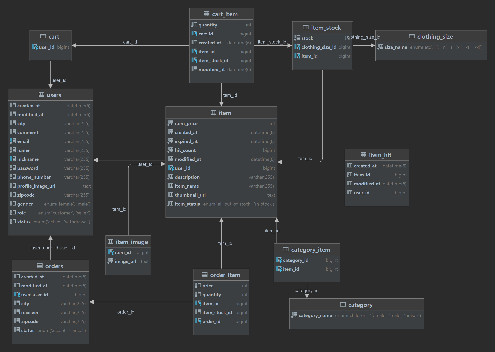

# 2st-shopping-mall-BE


## Introduction

---

이 줄에 프로젝트에 대한 간단한 정의 넣기
- **진행기간**:  2024.09.30 ~ 2024.10.11
- **진행 방식**
  - 진행방식 설명

- **프로젝트 전체 방향성**
  - 전체 방향성 설명
  

## Feature

---

### ⭐️ 도메인1
- #### 기능1

- #### 기능2

- #### 기능3


## Stack

---


[//]: # (스프링 관련)


[//]: # (데이터베이스 관련)


[//]: # (깃 관련)


[//]: # (노션)


[//]: # (테스트 관련)


[//]: # (인텔리제이)


## Architecture

---

### Package structure


```
├─main
│  ├─java
│  │  └─com
│  │      └─example
│  │          └─shoppingmall
│  │              ├─domain
│  │              │  ├─cart
│  │              │  │  ├─api
│  │              │  │  ├─application
│  │              │  │  ├─dao
│  │              │  │  ├─domain
│  │              │  │  ├─dto
│  │              │  │  └─excepction
│  │              │  ├─common
│  │              │  ├─item
│  │              │  │  ├─api
│  │              │  │  ├─application
│  │              │  │  ├─dao
│  │              │  │  ├─domain
│  │              │  │  ├─dto
│  │              │  │  ├─excepction
│  │              │  │  └─type
│  │              │  ├─order
│  │              │  │  ├─api
│  │              │  │  ├─application
│  │              │  │  ├─dao
│  │              │  │  ├─domain
│  │              │  │  ├─dto
│  │              │  │  ├─excepction
│  │              │  │  └─type
│  │              │  └─user
│  │              │      ├─api
│  │              │      ├─application
│  │              │      ├─dao
│  │              │      ├─domain
│  │              │      ├─dto
│  │              │      ├─excepction
│  │              │      └─type
│  │              ├─global
│  │              │  ├─annotation
│  │              │  ├─config
│  │              │  ├─exception
│  │              │  ├─lock
│  │              │  └─security
│  │              │      ├─detail
│  │              │      ├─dto
│  │              │      ├─filter
│  │              │      └─util
│  │              └─test

```
 각 패키지에 대한 간단한 설명 적기


## Erd

---



## Member

---


| 이름  | 역할         | Github |
|-----|------------|---|
| 유종화 |  |   |
| 이수연 |   |   |
| 유도경 |  |  |
| 임승진 |    |   |


### 소감 (선택)

